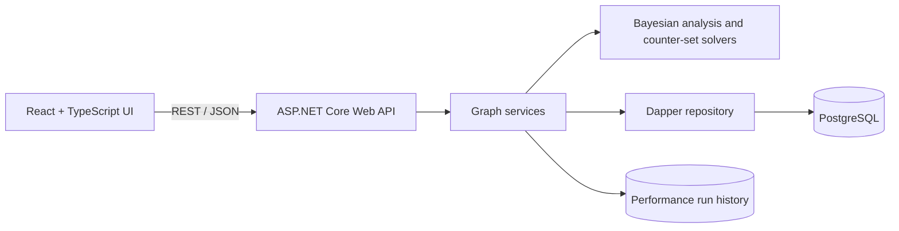

# Reasoning Graph Insights Engine

[](https://github.com/LogicLikely/reasoning-graph-insights-engine/actions/workflows/backend-ci.yml)
[](https://github.com/LogicLikely/reasoning-graph-insights-engine/actions/workflows/frontend-ci.yml)

A full-stack proof of concept for analyzing the structure and resilience of reasoning graphs.

LogicLikely is exploring structured reasoning systems as one way to improve online discourse. This project models claims, evidence, and objections as a directed graph, then combines interactive visualization with Bayesian analysis, counter-set search, sensitivity analysis, and repeatable performance reporting.

**[Open the live demo](https://insights.logiclikely.com/demo)** · [Project overview](https://insights.logiclikely.com/about) · [LogicLikely](https://www.logiclikely.com)

## Live demo

The deployed workspace lets visitors:

- navigate graphs of claims, evidence, and objections;
- inspect node and edge details in context;
- switch among database-backed examples and deterministic stress graphs; and
- explore saved benchmark history and performance trends in **Insights Lab**.

> The public deployment disables new Insights Lab runs so its comparison data remains stable. The existing History and Trends views remain fully available.

## Engineering highlights

- **Bayesian graph evaluation:** Prune a target-relevant directed acyclic graph to compatible evidence paths, calculate a Bayes factor, and apply it to the target's prior log odds.
- **Counter-set search:** Explore a minimum-counter-set problem motivated by NP-hard set-cover optimization. A fast greedy heuristic is compared with a time-bounded exhaustive reference implementation.
- **Evidence sensitivity:** Rank evidence by the predicted change when it is removed, then rank graph nodes by their sensitivity to one-at-a-time evidence removal.
- **Performance analysis:** Record timing, CPU use, managed allocations, graph and build metadata, and outcomes across deterministic graph shapes and sizes.
- **Full-stack graph workflow:** Support graph retrieval, visualization, node and edge editing, posterior recalculation, and database-backed persistence through a React client and ASP.NET Core API.

A completed exhaustive search can prove minimum cardinality because it examines candidate subsets in increasing size. If its server-owned time budget expires first, the result is explicitly recorded as partial and unproven. Stress fixtures cover balanced-tree, wide-star, deep-chain, and shared-diamond shapes from 100 nodes through an optional 100,000-node tier.

The reported values measure sensitivity inside the current model. They do not establish whether a claim is true or whether a piece of evidence is reliable.

## Architecture



| Area         | Implementation                                                                       |
| ------------ | ------------------------------------------------------------------------------------ |
| Frontend     | React 19, TypeScript, Vite, client-side routing, and interactive graph visualization |
| Backend      | ASP.NET Core 8, C#, controller-service-repository layering, Dapper, and Npgsql       |
| Data         | PostgreSQL graph storage plus a JSON performance-run store                           |
| Verification | MSTest and Moq; Vitest and Testing Library; Storybook; Cucumber and Playwright       |
| Automation   | Separate frontend and backend GitHub Actions gates                                   |

### Repository layout

```text
backend/          ASP.NET Core API, graph analysis, persistence, and reporting
backend.Tests/    Backend algorithm, service, repository, and API tests
frontend/         React application, component stories, and browser tests
docs/             Algorithm, benchmark, and implementation documentation
tools/            Deterministic stress-corpus generation and validation
```

## 2026 software engineering internship

This project was developed collaboratively during [Jacob Nuttall's](https://github.com/Jacobn99) Summer 2026 software engineering internship with LogicLikely. Jacob led the initial research and implementation of the minimal-counter-set analysis and authored the graph-pruning, Bayes-factor, and posterior-odds calculations that underpin the current solver. He also contributed to the React and ASP.NET Core integration, automated tests, and benchmarking tools.

Representative examples of his core algorithm work:

- [Graph-pruning stage](backend/Calculation/GraphBayesFactorPruner.cs)
- [Bayes-factor calculation](backend/Calculation/GraphBayesFactorCalculator.cs)
- [Posterior-odds calculation](backend/Calculation/GraphPosteriorOddsCalculator.cs)

The repository and production demo reflect collaborative review, refinement, and deployment throughout the project.

## Technical documentation

- [Graph-pruning and Bayes-factor algorithm](docs/graph-pruning-and-bayes-factor-algorithm.tex)
- [Performance Reporting and Insights Lab](docs/performance_reporting.md)
- [Bayesian-factor benchmark findings](docs/bayesian_factor_benchmark_findings.md)
- [Stress-corpus generation and validation](tools/stress-corpus/README.md)

## Local development

### Prerequisites

- [.NET 8 SDK](https://dotnet.microsoft.com/download/dotnet/8.0)
- Node.js 24, matching [.nvmrc](.nvmrc)
- PostgreSQL for database-backed graphs

Clone the repository:

```bash
git clone https://github.com/LogicLikely/reasoning-graph-insights-engine.git
cd reasoning-graph-insights-engine
```

Create and seed a local PostgreSQL database:

```bash
createdb insights
psql --dbname=insights --file=backend/data/sql/insights_seed.sql
```

> The seed script drops and recreates the graph tables. Run it only against a disposable local development database.

Configure and run the backend:

```bash
export Database__ConnectionString="Host=localhost;Port=5432;Database=insights;Username=postgres;Password=YourPasswordHere"
dotnet run --project backend/backend.csproj
```

Create `frontend/.env.local`:

```text
VITE_API_BASE_URL=http://localhost:5086
VITE_USE_FIXTURE=false
VITE_INSIGHTS_LAB_ALLOW_NEW_RUNS=true
```

Then run the frontend:

```bash
cd frontend
npm ci
npm run dev
```

Set `VITE_USE_FIXTURE=true` to load the bundled graph for UI development; server-side analyses still require the backend. Set `VITE_INSIGHTS_LAB_ALLOW_NEW_RUNS=false` to expose saved History and Trends without allowing new benchmark runs.

### CORS configuration

The API allows `http://localhost:5173` by default. To use another frontend origin, configure it before starting the backend:

```bash
export Cors__AllowedOrigins__0=https://your-frontend.example
```

Additional origins can use sequential indexes such as `Cors__AllowedOrigins__1` and `Cors__AllowedOrigins__2`.

## Verification

Run the backend suite from the repository root:

```bash
dotnet test
```

Run the frontend gates:

```bash
cd frontend
npm ci
npm run lint
npm run test
npm run build
npm run build-storybook
npm run func
```

With access to Chromatic credentials, publish the Storybook for visual review:

```bash
npm run chromatic
```

The GitHub Actions workflows run the backend Release build and test suite, plus frontend linting, unit tests, production and Storybook builds, browser-level functional tests, and Chromatic visual review.
